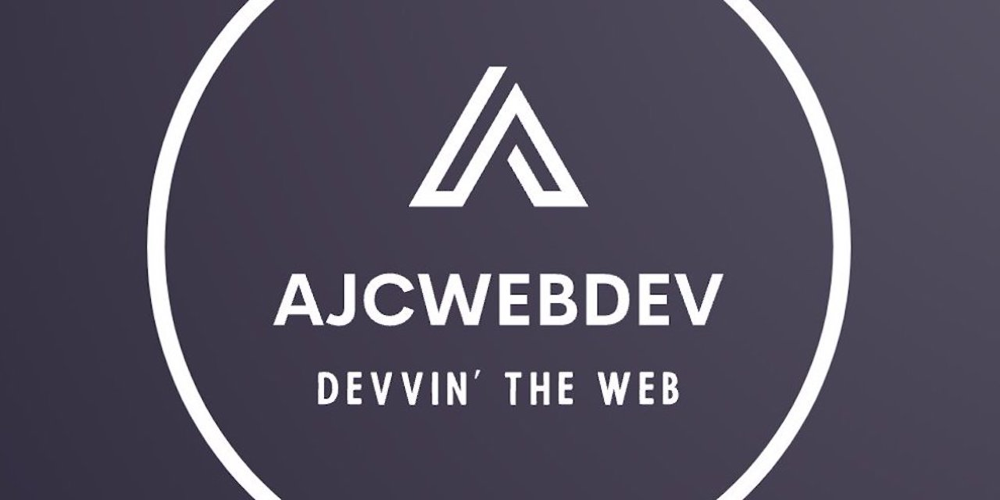

<div align="center">
  
  <h1>ajcweb.dev</h1>
</div>

## Outline

- [Introduction](#introduction)
- [Key Features](#key-features)
- [Commands](#commands)
- [Astro Configuration](#astro-configuration)
  - [OG Image](#og-image)
  - [Frontmatter](#frontmatter)
  - [Post Interface](#post-interface)
  - [Site Metadata](#site-metadata)
  - [Social Links](#social-links)
  - [Analytics](#analytics)
- [Deployment](#deployment)
  - [Netlify Configuration](#netlify-configuration)

## Introduction

> Astro Theme Cactus is a minimal, opinionated starter for blogs and websites built with the Astro framework, TypeScript, Tailwind, and MDX. You can view a [live demo](https://astro-theme-cactus.netlify.app/) of the original starter project hosted on Netlify. The theme is inspired by [Hexo Theme Cactus](https://github.com/probberechts/hexo-theme-cactus) and is licensed under the MIT License, Copyright © 2022.

[Create a new repo](https://github.com/chrismwilliams/astro-theme-cactus/generate) from this template.

## Key Features

- [Content Collections](https://docs.astro.build/en/guides/content-collections/) organize Markdown or MDX files, as well as type-checking frontmatter with a schema in `src/content/config.ts`
- [MDX](https://docs.astro.build/en/guides/markdown-content/#mdx-only-features) and Markdown posts
- [Astro Image Integration](https://docs.astro.build/en/guides/integrations-guide/image/) for optimized images
- [Satori](https://github.com/vercel/satori) for creating open graph png images
- [Automatic RSS feed](https://docs.astro.build/en/guides/rss)
- [Auto-generated sitemap](https://docs.astro.build/en/guides/integrations-guide/sitemap/)

## Commands

Replace pnpm with your choice of npm or yarn

| Command        | Action                                                         |
| :------------- | :------------------------------------------------------------- |
| `pnpm i`       | Installs dependencies                                          |
| `pnpm dev`     | Starts local dev server at `localhost:3000`                    |
| `pnpm build`   | Build your production site to `./dist/`                        |
| `pnpm preview` | Preview your build locally, before deploying                   |
| `pnpm sync`    | Generate types based on your config in `src/content/config.ts` |

## Astro Configuration

```js
// astro.config.mjs

import { defineConfig } from "astro/config"
import mdx from "@astrojs/mdx"
import tailwind from "@astrojs/tailwind"
import image from "@astrojs/image"
import sitemap from "@astrojs/sitemap"
import prefetch from "@astrojs/prefetch"

export default defineConfig({
  site: "https://ajcwebdev.com/",
  markdown: {
    shikiConfig: {
      theme: "dracula",
      wrap: false
    }
  },
  integrations: [
    mdx({}),
    tailwind({ config: { applyBaseStyles: false } }),
    sitemap(),
    image({ serviceEntryPoint: "@astrojs/image/sharp" }),
    prefetch()
  ],
  vite: {
    optimizeDeps: { exclude: ["@resvg/resvg-js"] }
  }
})
```

### OG Image

- Use the [Satori playground](https://og-playground.vercel.app/) to aid in OG image design.
- To change the style of the generated image from Satori, go to the markup function in `src/pages/og-image/[slug].png.ts` and edit the HTML/Tailwind classes.
- To generate an svg og images rather than the default `.png`, remove `@resvg/resvg-js` and return the svg within the body of the get function from `src/pages/og-image/[slug].png.ts`.
- Create your own og images and skip satori generating by adding an `ogImage` property in the frontmatter with a link to the asset, see `src/content/post/social-image.md` for an example.

### Frontmatter

Property and description (* required)

- `title` (*) - Used as the text link to the post, the h1 on the posts' page, and the pages' title property. Has a max length of 60 chars, set in `src/content/config.ts`.
- `description` (*) - Similar to above, used as the seo description property. Has a min length of 50 and a max length of 160 chars, set in the post schema.
- `publishDate` (*) - To change the date format/locale, currently **en-US**, update/pass the **locale** arg to function **getFormattedDate**, found in `src/utils.ts`.
- `layout` - Import [Markdown Layouts](https://docs.astro.build/en/core-concepts/layouts/#markdown-layouts). `src/layouts/BlogPost.astro` theme is used as a wrapper for all blog posts.
- `tags` - Tags are optional. Any new tag(s) will be shown in `domain.com/posts` + `domain.com/tags`, and generate the page(s) `domain.com/tags/[yourTag]`
- `image` - Blog cover art
- `ogImage` - This is an optional property. An OG Image will be generated automatically for every post where this property **isn't** provided. If you would like to create your own for a specific post, include this property and a link to your image, the theme will then skip automatically generating one.
- `canonicalURL` - [Canonical URL](https://developers.google.com/search/docs/crawling-indexing/consolidate-duplicate-urls) for blog posts

```markdown
---
canonicalURL: "https://ajcwebdev.com/2023/00/00/"
title: ""
description: ""
publishDate: "2023-00-00"
tags: [ "", "", "", "" ]
image: ""
layout: "@/layouts/BlogPost"
---
```

### Post Interface

```ts
// src/util.ts

interface Post {
	canonicalURL: string
	title: string
	description: string
	publishDate: Date
	tags?: string[]
	image: string
	layout: string
}
```

### Site Metadata

Site meta - `src/layouts/Base.astro`.

```ts
type SiteMeta = {
  title: string
  description?: string
  image?: string
  canonicalURL?: string
  publishDate?: string
}

const siteMeta = {
  title: "ajcwebdev",
  description: "Web developer, writer, speaker, and advocate",
  canonicalURL: "https://ajcwebdev.com",
  githubUrl: "https://github.com/ajcwebdev/ajcweb.dev",
  publishDate: "2022-11-14",
  image: "https://github.com/ajcwebdev/social-cards/blob/main/background-html.png?raw=true",
  github: "https://github.com/ajcwebdev",
  twitter: "https://twitter.com/ajcwebdev"
}
```

### Social Links

- Edit social links in `src/data/shared.ts` and in turn `src/layouts/Base.astro` to add/replace your media profile.
- Icons used can be found at [tablericons](https://tablericons.com/).

### Analytics

You may be asked to included a snippet inside the **HEAD** tag of your website when setting it up.

- This can be found in `src/layouts/Base.astro`
- Alternatively, you could add the snippet in `src/components/BaseHead.astro`

Providers you can use include web hosts such as:

- [Vercel](https://vercel.com/analytics)
- [Netlify](https://www.netlify.com/products/analytics/)
- [Cloudflare](https://www.cloudflare.com/web-analytics/)

Alternatively, you can use the [astro-google-analytics](https://www.npmjs.com/package/astro-google-analytics) package to include Google Analytics.

```bash
pnpm install astro-google-analytics
```

Edit `src/layouts/Base.astro` and replace `id` with your own Google Analytics ID:

```ts
---
import { GoogleAnalytics } from 'astro-google-analytics'
---

<head>
  <GoogleAnalytics id="G-XXXXXXXXXX" />
</head>
```

## Deployment

See the [Astro docs](https://docs.astro.build/en/guides/deploy/) for a breakdown of how to deploy your site to all of the platforms supported by Astro. By default, the site will be built to a static `/dist` directory (see `pnpm build` in [Commands](#commands) section above).

### Netlify Configuration

My site is deployed on Netlify and uses [Cloudflare Redirects](https://developers.cloudflare.com/pages/platform/redirects/) for my various domains.

```toml
# netlify.toml

[build.environment]
  NPM_FLAGS = "--version" # prevent Netlify npm install

[build]
  # command = 'pnpm run build'
  command = 'npx pnpm i --store=node_modules/.pnpm-store && npm run build'
  publish = 'dist'
```